# Mall Shopper Segmentation - Unsupervised Learning

## Project Overview

This project uses the Mall Customer Segmentation dataset to identify different shopper groups using unsupervised learning. The goal is to help a mall business understand customer spending behaviour and create useful retail strategies for each customer segment.

The project includes Exploratory Data Analysis, feature engineering, scaling, K-Means Clustering, Agglomerative Hierarchical Clustering, DBSCAN, algorithm comparison, customer persona creation, and a final deployment-style prediction function.

## Dataset

- Dataset: Mall Customer Segmentation Data
- Source: [Kaggle - Customer Segmentation Tutorial in Python](https://www.kaggle.com/datasets/vjchoudhary7/customer-segmentation-tutorial-in-python)
- Rows: 200 customers
- Main columns: `Gender`, `Age`, `AnnualIncome`, `SpendingScore`

## Video Submission Link

Video link: `PASTE_YOUR_GOOGLE_DRIVE_OR_YOUTUBE_LINK_HERE`

## Files Included

- `MallShopperSegmentation_UnsupervisedLearning.ipynb` - final practical notebook
- `Mall_Customers.csv` - dataset
- `mall_scaler.pkl` - saved StandardScaler
- `mall_segmentation_model.pkl` - saved K-Means model
- `summary_report.md` - short project report
- `requirements.txt` - required Python libraries
- `README.md` - project documentation

## How To Run

Install required libraries:

```bash
pip install -r requirements.txt
```

Then open the notebook and run all cells from top to bottom:

```text
MallShopperSegmentation_UnsupervisedLearning.ipynb
```

## Methods Used

- Exploratory Data Analysis
- Label Encoding
- Feature Engineering
- StandardScaler
- K-Means Clustering
- Elbow Method
- Silhouette Score
- Agglomerative Hierarchical Clustering
- Dendrogram Analysis
- DBSCAN
- k-NN Distance Plot
- Davies-Bouldin Index
- Calinski-Harabasz Index
- PCA Visualization
- Joblib Model Saving

## Final Customer Personas

- **Big Spenders** - High income and high spending customers. They are suitable for premium brand offers, luxury pop-ups, and VIP loyalty rewards.
- **Careful Spenders** - High income but low spending customers. They may need personalised discounts, exclusive events, or better engagement.
- **Young Aspirers** - Lower income but high spending customers. They are suitable for fashion, entertainment, food court, and lifestyle promotions.
- **Budget Shoppers** - Low income and low spending customers. They respond better to value stores, discount coupons, and budget-friendly campaigns.
- **Mature Savers** - Medium income and medium spending customers. They are balanced shoppers who can be targeted with seasonal offers and loyalty points.

## Graphs And Visualizations

### 1. Histograms for Age, Annual Income and Spending Score

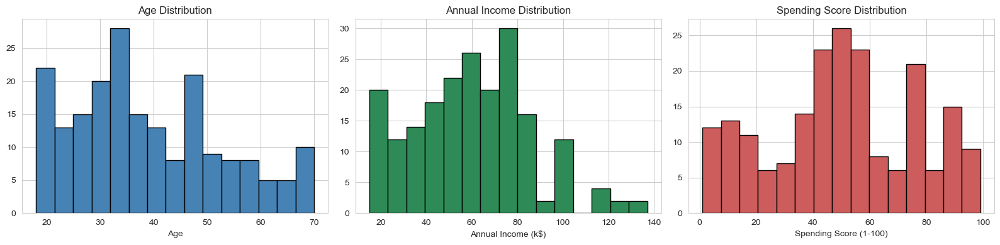

### 2. Boxplots to Spot Outliers

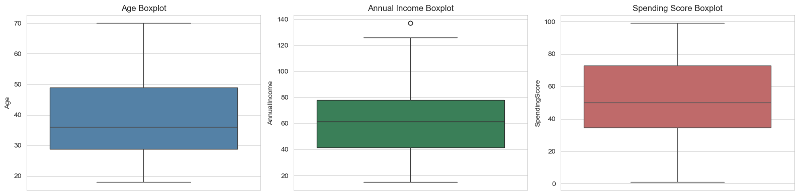

### 3. Countplot for Gender

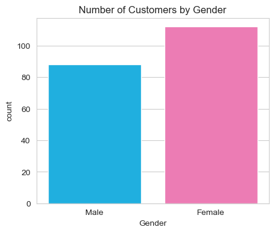

### 4. Annual Income vs Spending Score

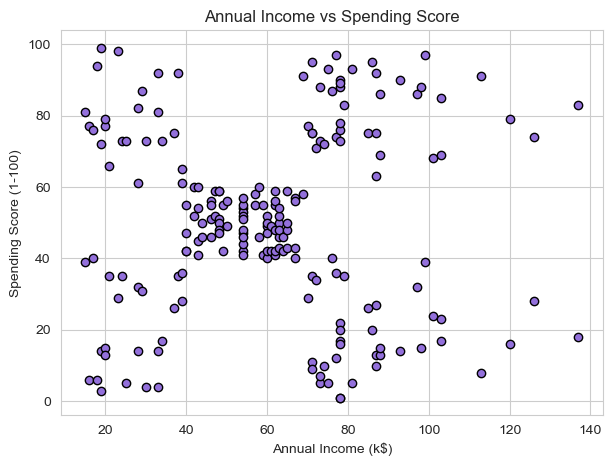

### 5. Age vs Spending Score by Gender

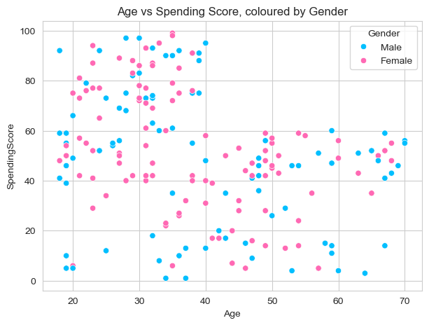

### 6. Age vs Annual Income by Gender

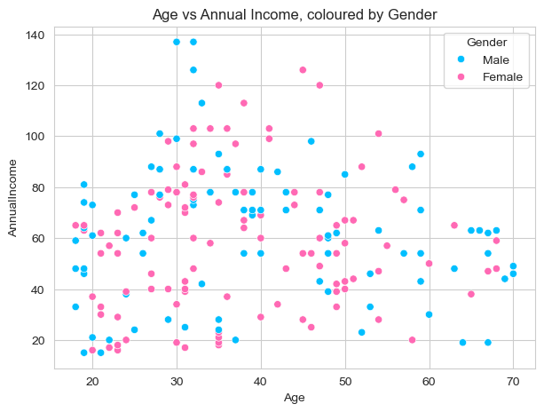

### 7. Correlation Heatmap

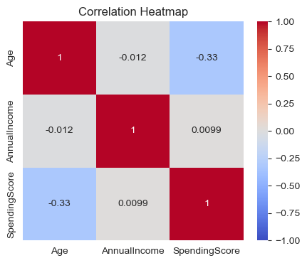

### 8. Gender Summary Bar Chart

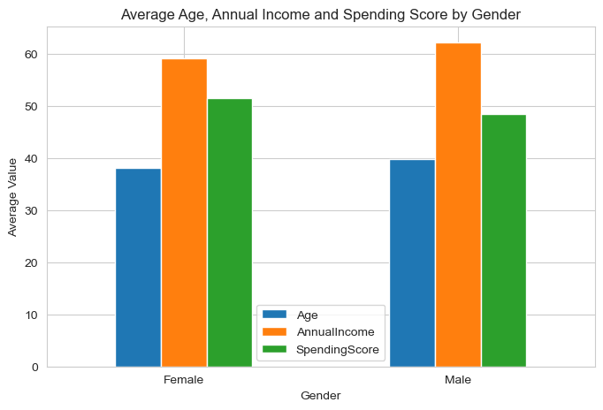

### 9. Elbow Curve and Silhouette Score

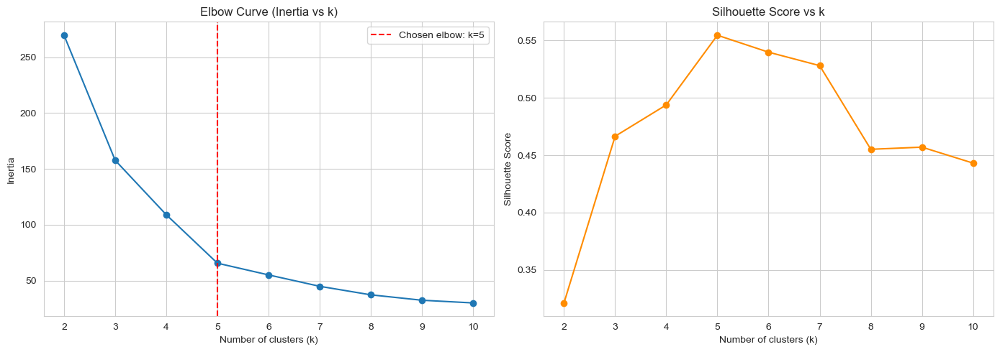

### 10. K-Means Clusters with Centroids

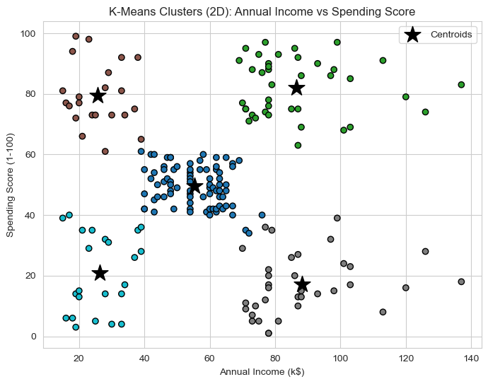

### 11. K-Means: Age vs Spending Score

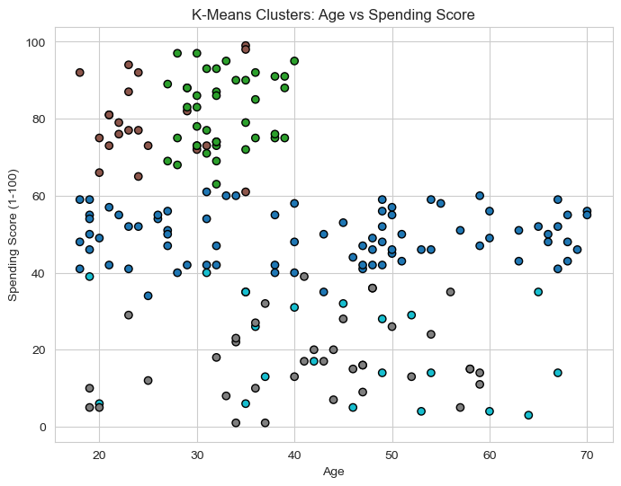

### 12. PCA Visualization for Multi-Feature K-Means

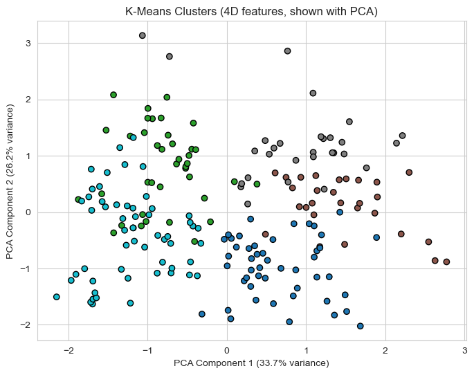

### 13. Full Agglomerative Dendrogram

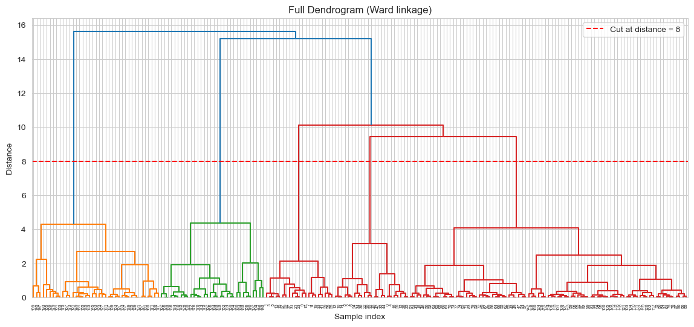

### 14. Truncated Agglomerative Dendrogram

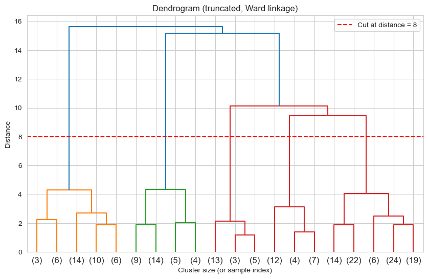

### 15. Agglomerative Clusters: Income vs Spending

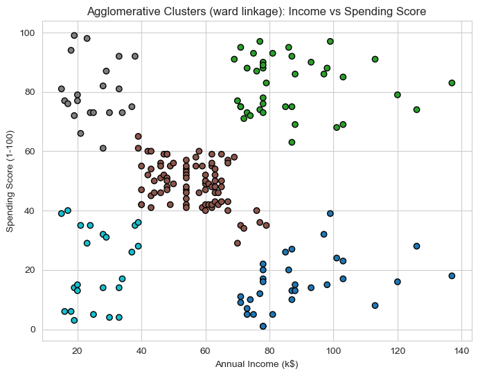

### 16. Agglomerative Clusters: Age vs Spending

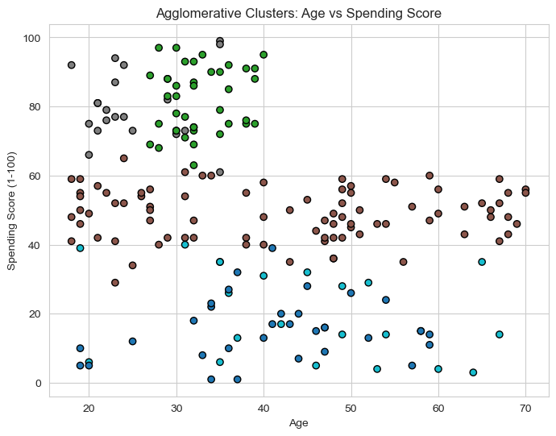

### 17. k-NN Distance Plot for DBSCAN Epsilon

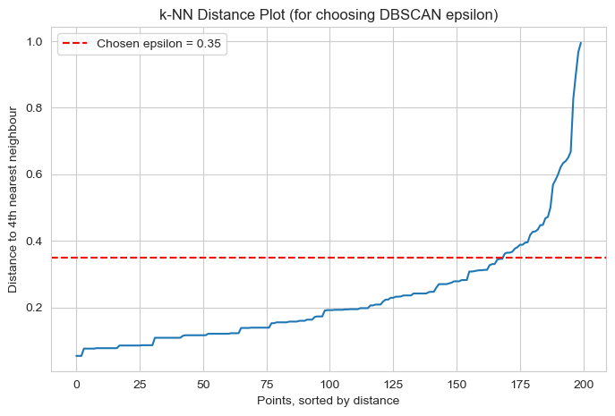

### 18. DBSCAN Grid Search Heatmap

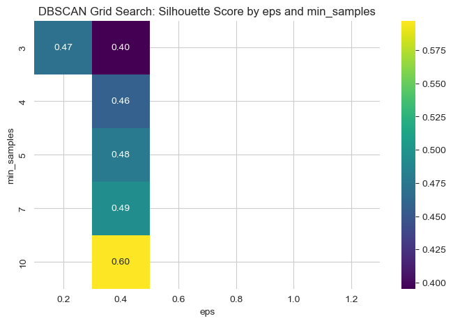

### 19. DBSCAN Clusters: Income vs Spending

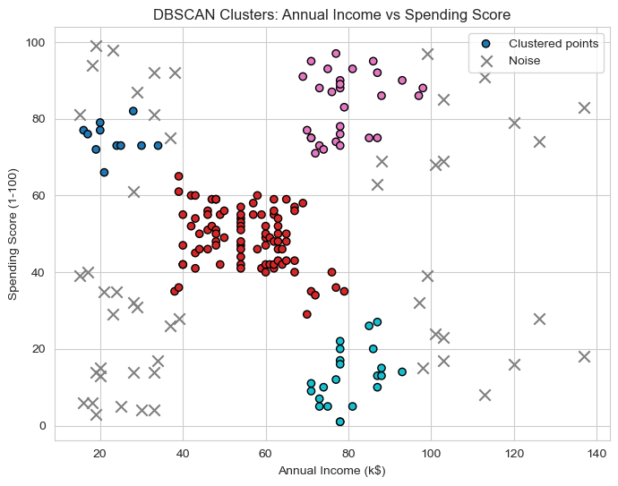

### 20. DBSCAN Clusters: Age vs Spending

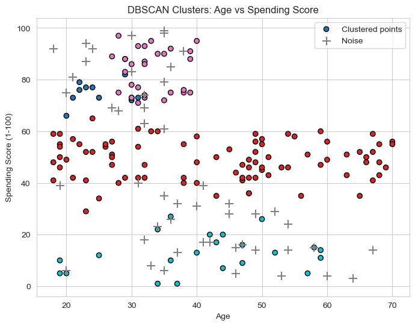

## Algorithm Recommendation

K-Means with `k = 5` is recommended as the final model because the Annual Income vs Spending Score plot clearly shows five natural customer groups. K-Means also creates easy-to-understand business segments and works well on this small, clean dataset. Agglomerative clustering gives a similar result, while DBSCAN is useful for identifying noise or borderline shoppers.

## Business Recommendation

The mall should use the five customer personas to plan targeted marketing and store placement. Premium offers should be aimed at Big Spenders, discount campaigns should target Budget Shoppers, and personalised engagement should be used for Careful Spenders. More behavioural data such as purchase history, visit frequency, loyalty app usage, and coupon redemption would improve future segmentation.

## GitHub Repository Name

Recommended repository name:

```text
mall-shopper-segmentation-unsupervised-learning
```
