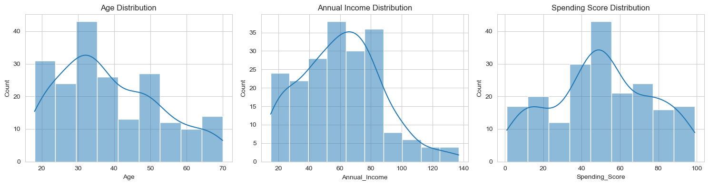
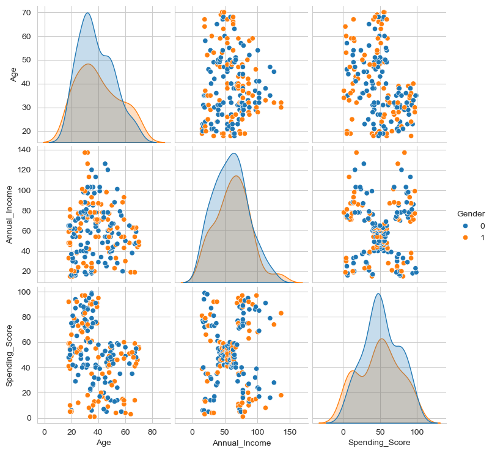
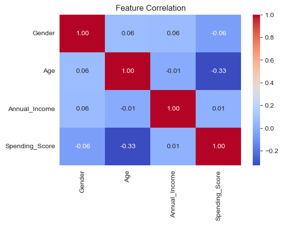
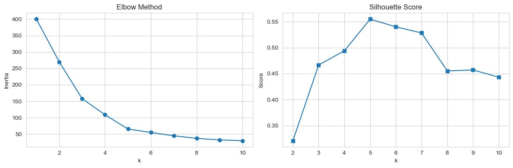
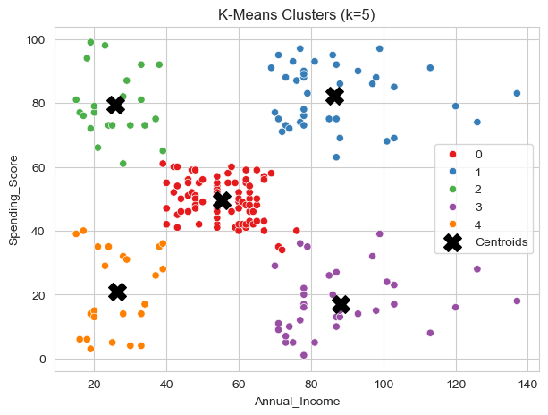
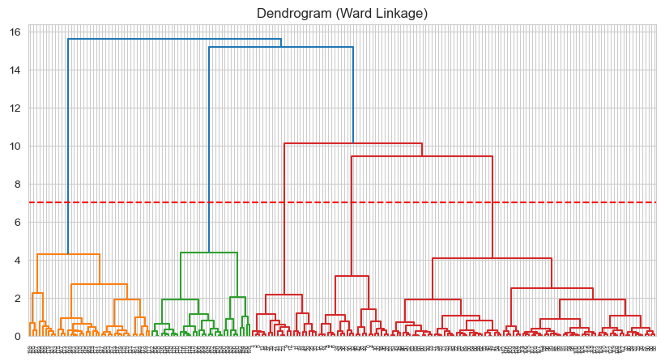
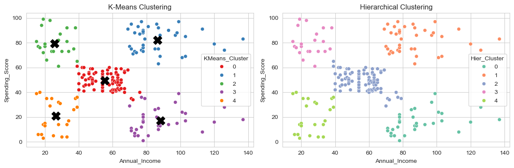
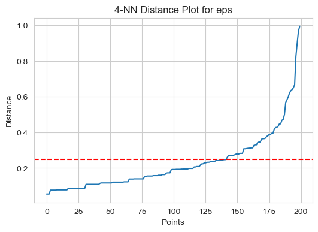
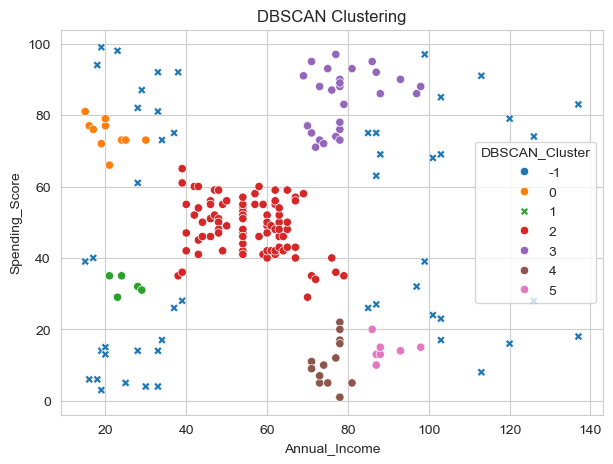
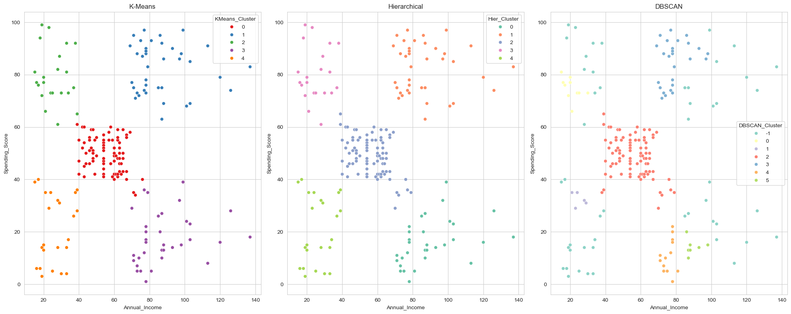

# 🛍️ Mall Customer Segmentation - PR1


## 📌 Project Overview

This project applies **Unsupervised Learning** on the Mall Customer Segmentation dataset. The main goal is to group mall customers into meaningful clusters using their age, annual income, and spending score.

The analysis helps understand different shopper behaviours and supports business decisions such as customer targeting, promotional planning, and mall marketing strategy.

---

## 🎯 Objective

The objective of this notebook is to:

- Load and understand the mall customer dataset
- Clean and prepare the data
- Perform feature distribution analysis
- Study correlation between features
- Scale numerical features
- Apply **K-Means Clustering**
- Apply **Hierarchical Clustering**
- Apply **DBSCAN Clustering**
- Compare all clustering algorithms visually and using metrics
- Select the best algorithm for this dataset

---

## 📁 Dataset Details

Dataset: **Mall Customer Segmentation Data**

The dataset contains customer demographic and spending information.

| Column | Description |
|---|---|
| `CustomerID` | Unique customer ID |
| `Gender` | Customer gender |
| `Age` | Customer age |
| `Annual_Income` | Annual income of customer |
| `Spending_Score` | Spending score assigned by mall |

After preprocessing, `CustomerID` is removed because it is only an identifier and does not help in clustering.

---

## ⚙️ Step 0: Initialization

The notebook starts with a complete initialization step. This step prepares all required libraries, settings, and common variables before running the analysis.

### ✅ Libraries Imported

```python
import pandas as pd
import numpy as np
import matplotlib.pyplot as plt
import seaborn as sns
from sklearn.preprocessing import LabelEncoder, StandardScaler
from sklearn.cluster import KMeans, AgglomerativeClustering, DBSCAN
from sklearn.neighbors import NearestNeighbors
from sklearn.metrics import silhouette_score, davies_bouldin_score, calinski_harabasz_score
from scipy.cluster.hierarchy import dendrogram, linkage
import warnings
```

### ✅ Initialization Tasks

- Warning messages are hidden using `warnings.filterwarnings('ignore')`
- Seaborn style is set using `sns.set_style('whitegrid')`
- Dataset is loaded using `pd.read_csv()`
- Column names are cleaned:
  - `Annual Income (k$)` → `Annual_Income`
  - `Spending Score (1-100)` → `Spending_Score`
- `CustomerID` is dropped
- `Gender` is encoded using `LabelEncoder`
- Numeric columns are scaled using `StandardScaler`
- A 2-feature dataset `df_2f` is created using:
  - `Annual_Income`
  - `Spending_Score`

---

## 🧭 Notebook Workflow

## 1️⃣ Data Loading And Inspection

The dataset is loaded and inspected using:

- `head()`
- `info()`
- `describe()`

This helps understand the dataset shape, column types, and statistical summary.

## 2️⃣ Data Cleaning

The notebook renames long column names into shorter and cleaner names. `CustomerID` is removed because it does not provide useful clustering information.

## 3️⃣ Gender Encoding

The `Gender` column is converted into numeric form using label encoding. This allows it to be used in numeric analysis and correlation calculations.

## 4️⃣ Feature Distributions

Histograms are plotted for:

- Age
- Annual Income
- Spending Score

This helps understand how each feature is distributed.

## 5️⃣ Pairplot And Correlation Heatmap

A pairplot is used to visualize pairwise relationships between features. A correlation heatmap is used to measure linear relationships between numerical variables.

Key observation:

- Most correlations are weak.
- Age and Spending Score show a negative relationship.
- Annual Income and Spending Score are useful for clustering because they can form visual groups.

## 6️⃣ Feature Scaling

`StandardScaler` is used to scale numerical features. Scaling is required because clustering algorithms use distance calculations.

Without scaling, features with larger values can dominate the clustering result.

## 7️⃣ K-Means Clustering

K-Means is tested using:

- Elbow Method
- Silhouette Score

The final number of clusters is selected as:

```text
k = 5
```

K-Means creates simple and clear customer groups.

## 8️⃣ Hierarchical Clustering

Hierarchical clustering is performed using Ward linkage. A dendrogram is plotted to understand how clusters are formed step by step.

The final clustering uses:

```text
n_clusters = 5
linkage = ward
```

## 9️⃣ DBSCAN Clustering

DBSCAN is used to find density-based clusters. A 4-NN distance plot is used to understand a suitable `eps` value.

Grid search is performed using different:

- `eps`
- `min_samples`

DBSCAN can mark some points as noise using label `-1`.

## 🔟 Algorithm Comparison

All three algorithms are compared using:

- Visual cluster plots
- Silhouette Score
- Davies-Bouldin Score
- Calinski-Harabasz Score

---

## 📊 Graphs And Visualizations

## 📈 1. Feature Distributions

This graph shows the distribution of Age, Annual Income, and Spending Score.



## 🔎 2. Pairplot

The pairplot shows relationships between features and helps identify visible patterns.



## 🔥 3. Correlation Heatmap

The heatmap shows correlation values between numerical features.



## 📉 4. Elbow Method And Silhouette Score

This graph helps choose the best number of clusters for K-Means.



## ⭐ 5. K-Means Clustering With k=5

This graph shows the five K-Means clusters with centroids.



## 🌳 6. Dendrogram

The dendrogram shows how hierarchical clustering merges data points into clusters.



## 🔵 7. K-Means vs Hierarchical Clustering

This graph compares K-Means and Hierarchical clustering side by side.



## 📏 8. DBSCAN 4-NN Distance Plot

This graph helps select the `eps` value for DBSCAN.



## 🔴 9. DBSCAN Clustering

This graph shows clusters created by DBSCAN and highlights density-based grouping.



## 📊 10. Final Algorithm Visual Comparison

This graph compares K-Means, Hierarchical Clustering, and DBSCAN in one view.



---

## 🧪 Evaluation Metrics

The project uses three clustering evaluation metrics:

| Metric | Meaning | Best Value |
|---|---|---|
| Silhouette Score | Measures how well-separated clusters are | Higher is better |
| Davies-Bouldin Score | Measures cluster similarity | Lower is better |
| Calinski-Harabasz Score | Measures compactness and separation | Higher is better |

---

## 🏆 Final Recommendation

✅ **K-Means with k = 5** is the best choice for this dataset.

Reasons:

- It gives clear and simple customer groups
- It performs well using Silhouette Score
- It creates easy-to-understand clusters
- It is useful for business and marketing interpretation
- The clusters match the visual pattern in the Annual Income vs Spending Score plot

---

## 🔴 DBSCAN vs K-Means

- DBSCAN does not need the number of clusters in advance.
- DBSCAN can mark low-density points as noise using label `-1`.
- K-Means assigns every point to a cluster, even if the point behaves like an outlier.
- For this dataset, K-Means is easier to explain and more useful for final segmentation.

---

## 💼 Business Use

Mall management can use these clusters to:

- Identify high-spending customers
- Create targeted offers
- Improve customer loyalty programs
- Plan store layout
- Build customer personas
- Design marketing campaigns

---

## 📦 Files For Submission

Upload these files to GitHub:

- `PR1ipynb.ipynb`
- `PR1ipynb.html`
- `Mall_Customers.csv`
- `README.md`

---

## ▶️ How To Run

Install required libraries:

```bash
pip install pandas numpy matplotlib seaborn scikit-learn scipy
```

Open the notebook:

```text
PR1ipynb.ipynb
```

Run all cells from top to bottom.

---

## ✅ Final Checklist

- ✅ Initialization added
- ✅ Dataset loaded
- ✅ Columns cleaned
- ✅ Gender encoded
- ✅ Features scaled
- ✅ EDA completed
- ✅ Pairplot added
- ✅ Correlation heatmap added
- ✅ K-Means clustering completed
- ✅ Hierarchical clustering completed
- ✅ DBSCAN clustering completed
- ✅ Evaluation metrics added
- ✅ Recommendation added
- ✅ HTML export created
- ✅ README with graphs created

---

## 👨‍💻 Author

Created for **Unsupervised Learning Practical 1**.
